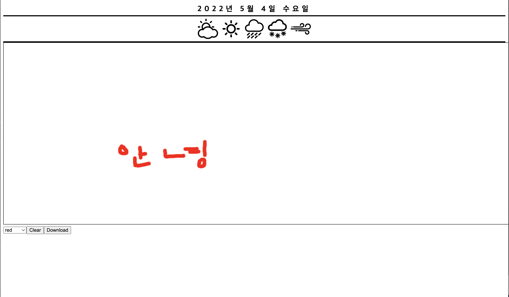

# Final Project 3주차 회고

4주차에 쓰는 3주차 회고록이지만 최대한 기억을 끄집어내어 기록해보겠다.
cors 에러를 해결하기 위해 2주차 회고에 적힌 내용대로 AWS를 이용하여 배포를 먼저
진행해보기로 하고 배포를 하려고 했는데 팀장님이(본업을 안하고 계심) 시간이 많으시다는 이유로 배포를 처음부터하게 되셔서 본의 아니게 배포를 내가 하지 못하게 되었다.

커뮤니케이션을 중요로 하는 팀 프로젝트이니만큼 배포를 먼저하시더라도 양해를 구하거나,
혹은 같이 모각코를 통하여 해봤으면 어땠을까했다.
(First Project에서 http 배포까지는 해봤지만 HTTPS 배포를 하지 못했어서 내가 배포를 하고
싶었던 이유이기도 하다.)

3주차에는 커뮤니케이션, 내 자신에 대한 실력에 대해서 많은 좌절감도 느끼고(너무 부족하다 느꼈다.)
그냥 온전히 내가 구상한대로 코딩을 하지 못하고, 어떤 프로젝트의 일부분을 가져와서 쓴다던가
레퍼런스의 코드들을 참고한다던가(솔직한 말로 그냥 남의 것?)밖에 안되는 실력인 것 같아서
여러가지 복합적인 감정으로 중도하차를 하고 싶었던 순간이 한 두번이 아니였다.

한 분은 열심히 해주시는데 한 분은 개인적인 일정상 커뮤니케이션도 힘들었고
커뮤니케이션에 대한 태도 또한 적극적이지 않으셔서 난감한 상황이 여러번 있었다.
"하지만 어쩌겠는가 둘이서라도 해야지" 라는 생각을 다 잡는 한 주가 되었던 것 같다.

## diaryinfo components


위와 같이 현재 diary page에 diaryinfo(형식)을 구현하고 있다.
원래 canvasdraw component가 먼저 코드가 짜여져 있었던 page였는데.
diaryinfo component를 넣고 나니 마우스의 위치로 그려지는 canvas에 위치가 다르게 선이 생성되게 되었다
이 부분은

```
const [lastPosition, setPosition] = useState({
    x: 0,
    y: 0
  });

  useEffect(() => {
    if (canvasRef.current) {
      ctx.current = canvasRef.current.getContext('2d');
    }
  }, []);
```

위 코드(팀원 코드)와 같이 x, y의 축을 수정해주면 해결이 될 것 같다.

현재 canvas 밑에 diaryinfo component에서 글을 쓸 수 있게끔 기능을 구현,
날씨 아이콘을 클릭시에 아이콘의 색이 점차 오렌지색으로 차오르게끔 clickevent를 구현,
weatherId를 서버에 전달하여 저장하여 내가 썼던 일기장이나, 친구가 썼던 일기장에서 데이터를
클릭했을때 weather, Date, DiaryImg, Content등을 GET 요청을 했을때 받아올 수 있게끔
구현을 해야한다.

## 1.1 Keep(장점, 지킬 점)

- 프로젝트 기획시 생각했던 것보다 좋은 아이디어가 있으면 회의를 통하여 적극적으로 디벨롭하려는 자세가 좋았다
- 포지션 상관없이 적극적으로 참여하는 부분이 좋았다
- 각자의 상황이 힘들고 시간이 없어도 계속 포기하지않았던 부분이 좋았다.
- 받은 피드백으로 문제 해결을 하려고 노력하였다.

## 1.2 Problem (단점, 변경 또는 버릴 점)

- 팀원 전체간의 의사소통이 너무 부족하다
- 포지션 구분 없이 하는 것은 좋으나
  팀원 모두와 상의후 진행을 하거나 같이 진행을 했었으면 좋았을 것 같다
- 모르면 물어보는 적극적인 자세가 더 필요하다.
- 현재 각자 어떤 부분을 코딩하고 있는지 서로 알려주었으면 좋겠다.

## 1.3 Try(시도할 점, 앞으로의 행동)

- 정말 모르겠는건 아고라스테이츠나 코더분들에게 물어보기(물어보는건 나쁜게 아니다)
- 적극적인 참여와 자세
- 팀프로젝트의 의의를 두고 많은 커뮤니케이션
- 뼈대를 빨리 잡아야 디테일적인 부분을 개선할 수 있을 것 같다.
