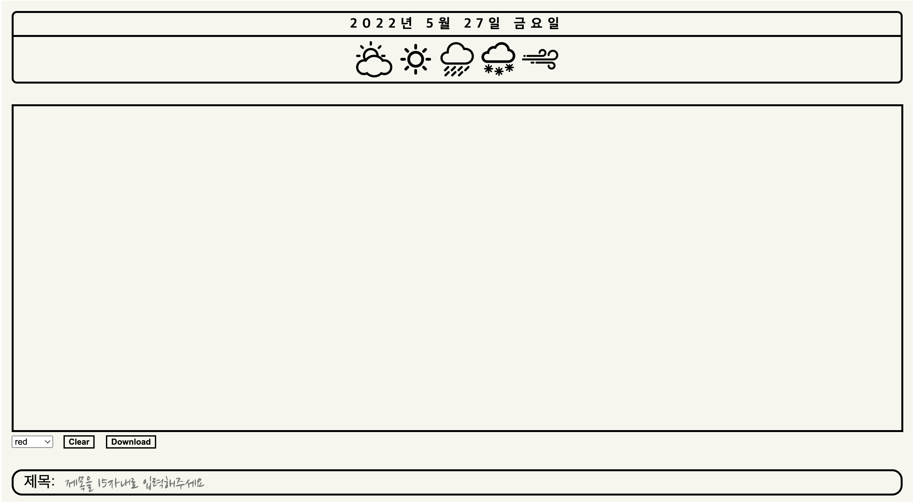

# Final Project 4주차 회고

회고록이 1주씩 밀리고 있는 상태인데 여러가지 이유가 있기도 했고
정신없이 하루하루를 보내는 것 같다..

일단 그동안에 쌓여 있던 감정과 불만이 터져나와서 다른 팀원과 회의를 통해
(프로젝트를 함에 있어서 팀원 한 분의 커뮤니케이션, 회의 무단 불참)
이 문제를 해결하기 위해 코드스테이츠 코더 한 분에게 해당 이슈를 주말에 말씀 드렸다.
그리고 그 분께서 참여하셨던 First Project의 팀원 한 분에게 오랜만에 연락을 드려
실례가 되는줄 알면서도 이 문제가 혹시 이전에도 똑같이 있었는지 확인하고 싶어
Zoom을 통해 해당 이슈에 대해 말하고 그 문제에 있어서
여러 말씀을 전해 들었다. 그리고 난 그 이후 사람과의 관계에 있어서 회의감을 많이 느끼며
작업을 하며 주말을 보냈다. 솔직히 이 때 하차관련해서 많은 고민을 했었던 시기이기도하다.

그리고 그 회의 무단 불참하셨던 팀원분께서 주말에 디스코드로 현재 겪고 계신 상황과 몸이 아파서
병원에 갔다가 회의를 참여하지 못했단 말을 전해듣고 어떠한 답변을 해야되나 고민을 수도 없이 했지만
할 수 없었고 그 다음주 월요일(5주차)에 코더분과 상의 끝에 문제를 해결할 수 있게 도와주시어

그동안 내가 겪었던 부분과 아쉬웠던 부분을 그 분과 팀 디스코드방에서 많은 이야기를 주고 받고
앞으로의 그분의 계획과 적극적인 참여 부분에 있어서 확답을 듣고 잘 마무리 되었다.

SkillPul하지 못하고 내가 원하는 방향을 같이 바라보며 공부에만 온전히 시간을 쏟을 수 없는 나 자신에게
많이 실망도하고 좌절도 했던 한 주였다.

커뮤니케이션에 관련해서 프로젝트를 이끌어가기 위해 팀원들과 소통은 매우 중요하다고 생각한다.
그게 코드스테이츠측에서 제일 중요시 생각하는 부분이라고도 생각한다. SkillPul한 것도 좋지만
작업자들과의 사이에서 많은 코드들이 오가는 실무에서 커뮤니케이션이 안된다면 무슨 소용이 있을까?
그 점에서 나는 다른 사람들보다 강점이 있다고 생각한다. 그리고 skill적인 부분은 남들보다 느리지만
더 열심히하자 모든 시간들은 나에게 경험이고 나의 장점이자 강점으로 변경될 것이다.

## diaryinfo components

현재 Frontend적인 부분은 어느정도 마무리가 되었으나 canvas에서 png로 저장된 파일을
S3 이미지 버킷에, url 은 데이터베이스에 저장하고 모든 좌표 데이터 또한 데이터베이스에 저장할 계획이다.

### Multer?

- Multer는 파일 업로드를 위해 사용되는 multipart/form-data 를 다루기 위한 NodeJS의 미들웨어이다.
- Multer는 단일 및 다중 파일 업로드 모두를 지원해주기 때문에 node에서 파일 업로드 기능을 구현할 때 많이 사용되고 있다.

## 도움 받은 사이트

multer 로 이미지 업로드하기: (www.zerocho.com/category/NodeJS/post/5950a6c4f7934c001894ea83)

## 1.1 Keep(장점, 지킬 점)

- 커뮤니케이션이 원활히 되어서 좋았다.

## 1.2 Problem (단점, 변경 또는 버릴 점)

- 팀 프로젝트를 함에 있어서 적극적인 태도가 필요하다.

## 1.3 Try(시도할 점, 앞으로의 행동)

- 팀 룰을 꼭 지킬것.
